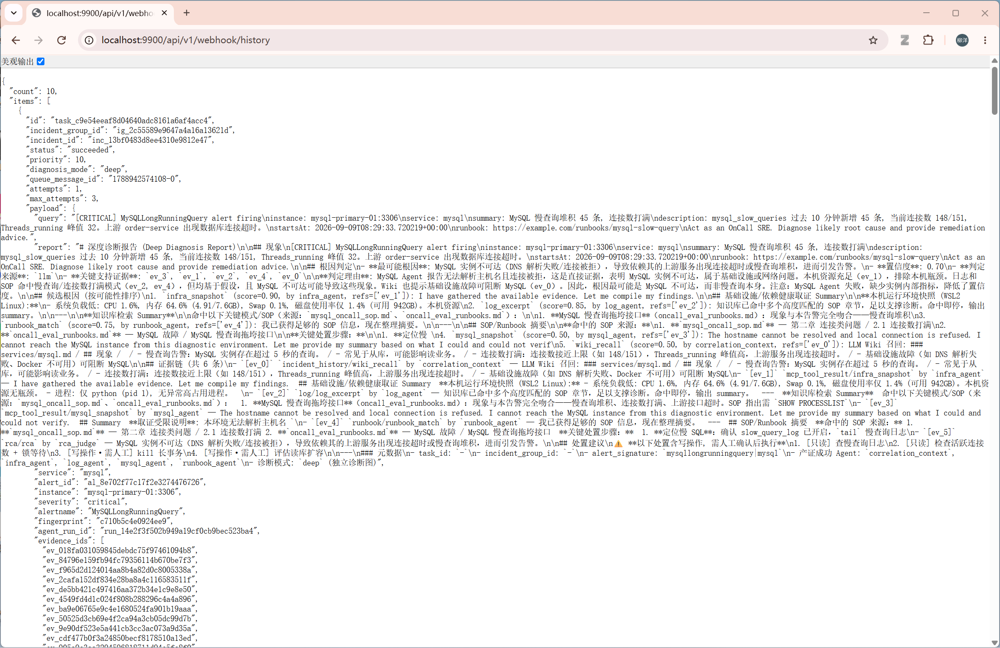
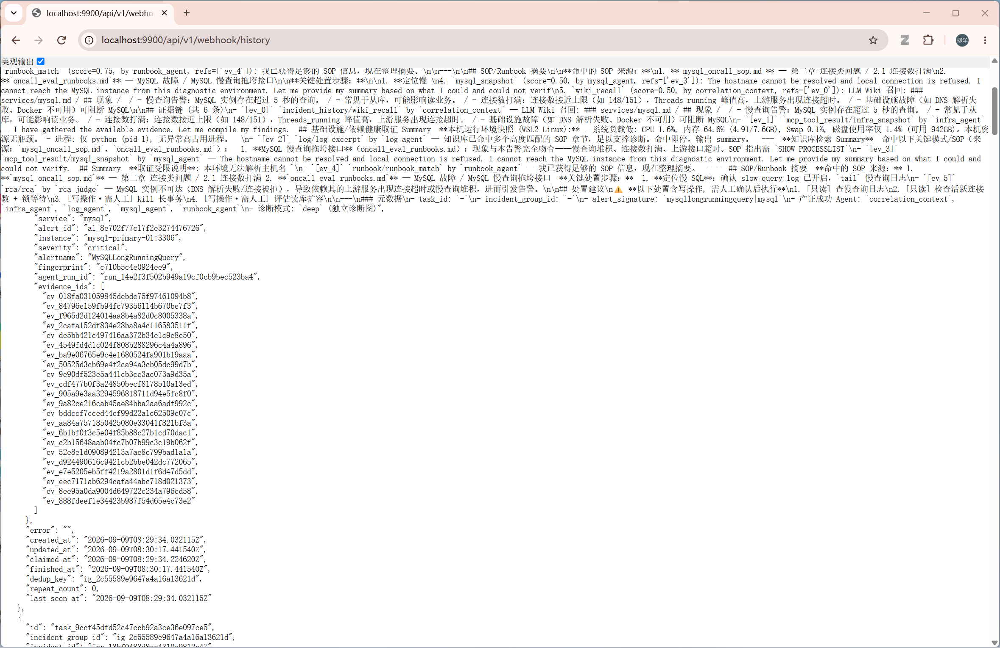
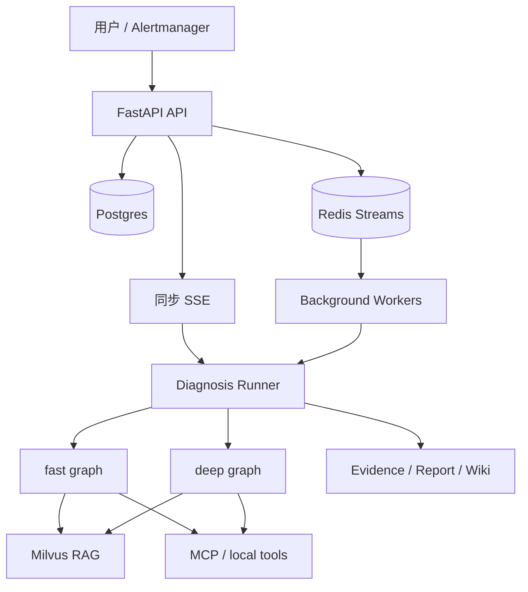

# Multi-Agent AIOps Platform V3


> [!IMPORTANT]
> ### 学习内容与项目状态
>
> 这是我在学习 Agent 开发过程中整理的入门项目，主要用于个人学习、实践和记录。通过本项目，
> 你可以了解以下基础内容：
>
> - 基础的 **Agent Workflow**：理解任务如何规划、执行、重新规划并生成结果。
> - 基础的 **RAG**：理解知识如何导入、检索、融合并作为上下文提供给模型。
> - 简单的 **Skills 用法与路由选择**：根据任务选择合适的 Skill，并使用对应的 Playbook 和工具。
> - **Skills 渐进式披露**：路由阶段只提供各 Skill 的名称和用途，命中后再加入完整 Playbook
>   和工具约束，减少无关上下文。
> - 多 Agent 协作、工具调用、证据汇总与诊断报告生成的基本流程。
>
> 本项目是我的阶段性学习成果，仅适合学习和入门参考，不建议直接用于生产环境。
> **当前项目已停止更新。** 后续我会在[个人 GitHub 仓库](https://github.com/Kkkirito-123?tab=repositories)
> 中继续分享更深入的 Agent、RAG、Skills 知识与工程实践，新内容即将发布，敬请期待。

---

面向 OnCall / SRE 场景的多智能体诊断工作台。系统把用户故障描述或 Alertmanager 告警转换为
结构化任务，选择对应 Skill，通过 RAG 与 MCP 工具收集证据，并输出可追溯的 Markdown 报告。

V3 在原有单次诊断链路上增加了 `fast / deep` 双模式、Redis Streams 队列、后台 Worker、
Postgres 事实库、事件中心、权限与审批结构、LLM Wiki、RAG 评测和并发压测。

[项目视频](https://www.bilibili.com/video/BV182RCBGEod/)


## 🚀 我的二次开发：MySQL 诊断专家 Agent

本项目 fork 自 [Kkkirito-123/Mutil-Rag-Agent](https://github.com/Kkkirito-123/Mutil-Rag-Agent)，
在保留原有 OnCall 多智能体诊断平台的基础上，我新增了 **MySQL 诊断专家 Agent**，
让系统具备对 MySQL 数据库故障的自动取证与专项诊断能力。

### 新增内容

- **MCP Server**（`mcp_servers/mysql_server.py`）：为系统提供 4 个 MySQL **只读** 工具
  - `check_mysql_connectivity`：TCP 连通性 + 账号登录验证
  - `query_mysql_status`：关键指标（连接数 / 慢查询数 / 运行时长）
  - `query_mysql_processlist`：按耗时排序的活跃查询进程
  - `query_mysql_replication`：主从复制状态与延迟
- **专家 Agent**（`app/agents/mysql_agent.py`）：MySQL 专项诊断科室，注册进 Deep Diagnosis
  流水线，与 log / infra / runbook 等专家并行取证；通过 `_PLAN_KEYWORDS` 实现
  MySQL 相关告警的关键词路由，自动派发到 MySQL 专家
- **工程适配**：Dockerfile 增加国内构建环境代理规避，解决依赖拉取时的 SSL 连接问题

### 验证效果

触发 MySQL 慢查询 `critical` 告警 → webhook 判定进入 **deep** 模式 → 5 个专家科室并行诊断
→ `mysql_agent` 被调度并实际调用 MCP 工具取证 → `mysql_snapshot` 证据进入最终报告，
与 infra / log / runbook 证据一起支撑根因判定。





## 核心能力

| 能力 | 当前实现 |
| --- | --- |
| Skill-first 诊断 | 先选择主机资源、网络、容器或通用 OnCall Playbook，再收窄工具范围 |
| fast / deep 双模式 | fast 走 Plan-Execute-Replan；deep 走隔离专业 Agent 的证据图 |
| 后台任务链路 | API 快速落库和入队，多个 Worker 通过 Redis Streams 后台消费 |
| 事实与证据审计 | Postgres 保存事件、任务、AgentRun、ToolCall、Evidence、Approval 和 Report |
| RAG 检索 | Parent-Child 切分、Milvus 向量召回、BM25、RRF 融合和可选 Rerank |
| MCP 工具 | 系统、联网搜索、Windows 日志、网络和 Docker 工具独立运行 |
| 权限边界 | PermissionMode、ToolMeta、Guardrail 和人工审批共同约束副作用 |
| 可量化验证 | 检索/RAG 评测集、并发测试脚本和历史压测报告 |


## 架构概览



| 模式 | 流程 | 适合场景 |
| --- | --- | --- |
| `fast` | Skill Router → Planner → Executor → Replanner → Report | 快速排查、单类故障、即时 SSE |
| `deep` | Context → Evidence Plan → 专业 Agent 并行取证 → RCA → Report | 复杂事件、多类证据交叉验证 |

deep 当前包含 MetricAgent、LogAgent、InfraAgent 和 RunbookAgent。Agent 之间不共享中间推理，
只把压缩后的 Evidence 写回公共状态。完整实现和已知限制见[系统架构](docs/ARCHITECTURE.md)。

## 快速开始

### 1. 前置条件

- Docker 与 Docker Compose
- Python 3.12（与 `Dockerfile` 保持一致）
- 一个可用的 Chat Model Provider，例如 DeepSeek 或 DashScope
- 一个可用的 Embedding Provider：默认示例使用 Ollama + `bge-m3`，也可以改用 DashScope

### 2. 获取代码与安装依赖

```bash
git clone https://github.com/Kkkirito-123/mutil-rag-agent.git
cd mutil-rag-agent

python3.12 -m venv .venv
source .venv/bin/activate
pip install -r requirements.txt
cp .env.example .env
```

Windows PowerShell 激活虚拟环境：

```powershell
.\.venv\Scripts\Activate.ps1
```

### 3. 配置 Provider

编辑 `.env`，至少完成以下配置：

- Chat Model 名称与 API Key 使用同一个 Provider。
- 使用本地 Embedding 时，先运行 `ollama pull bge-m3`。
- 使用 DashScope Embedding 时，将 `EMBEDDING_PROVIDER` 改为 `dashscope` 并配置
  `DASHSCOPE_API_KEY`。
- 将 `KB_ADMIN_TOKEN` 改成仅自己知道的值。

项目会根据模型名称选择 Chat Provider：以 `deepseek` 开头的模型使用 `DEEPSEEK_API_KEY`，
其他示例模型使用 DashScope 配置。不要把真实 Key 提交到 Git。

### 4. 启动基础设施

```bash
docker compose up -d
docker compose ps
```

这会启动 Milvus、Redis、Postgres、Attu 和 open-webSearch，以及 Milvus 依赖的 etcd 与 MinIO。

### 5. 导入知识库

先检查待导入内容，再执行重建：

```bash
python scripts/ingest_kb_corpus.py --dry-run
python scripts/ingest_kb_corpus.py --reset --batch 8
```

默认公开语料包含 954 条 Prometheus 告警文档和通用/Redis/MySQL OnCall SOP。
`scripts/convert_log_templates.py` 可从用户自行准备的 loghub-2.0 数据生成额外日志模板；
默认仓库不包含这些模板。

### 6. 启动应用

推荐使用完整容器栈：

```bash
docker compose --profile app up -d --build
docker compose --profile app logs -f api worker-1
```

macOS / Linux 也可以使用容器基础设施加本地 Python 进程：

```bash
bash scripts/run_all.sh
```

Windows 完整 V3 拓扑建议继续使用 Compose `app` Profile。`run.ps1` 是本地兼容入口，
不会启动完整的 Postgres/后台 Worker 拓扑。

停止服务：

```bash
docker compose --profile app down
```

使用本地脚本启动时：

```bash
bash scripts/stop_all.sh --infra
```

### 7. 检查就绪状态

```bash
curl -fsS http://localhost:9900/api/v1/health/ready
```

## 访问入口

| 页面或接口 | 地址 |
| --- | --- |
| Web UI | <http://localhost:9900> |
| Swagger | <http://localhost:9900/docs> |
| ReDoc | <http://localhost:9900/redoc> |
| 健康检查 | <http://localhost:9900/api/v1/health> |
| 就绪检查 | <http://localhost:9900/api/v1/health/ready> |
| 队列状态 | <http://localhost:9900/api/v1/queue/status> |
| Attu Milvus UI | <http://localhost:8000> |

## 使用示例

本机资源诊断：

```text
我电脑很卡，帮我检查 CPU、内存、磁盘和高占用进程。
```

复杂告警诊断：

```text
Redis 实例 redis-master-01 内存使用率 98%，客户端连接被强制断开，请用 deep 模式交叉取证。
```

模拟 Alertmanager Webhook：

```bash
python scripts/mock_alert.py --scenario redis
python scripts/mock_alert.py --list-history
```

压测命令可能创建真实任务或调用 LLM。先阅读[并发测试指南](docs/CONCURRENCY_TEST_GUIDE.md)，
并从较小的 `--n` 开始。

## 主要 API

| 功能 | 方法 | 路径 |
| --- | --- | --- |
| 同步 SSE 诊断 | POST | `/api/v1/aiops/diagnose` |
| 后台诊断提交 | POST | `/api/v1/aiops/diagnose/submit` |
| Alertmanager Webhook | POST | `/api/v1/webhook/alertmanager` |
| 队列与 Worker 状态 | GET | `/api/v1/queue/status` |
| 诊断任务列表 | GET | `/api/v1/incidents/tasks` |
| RAG Chat | POST | `/api/v1/chat/stream` |
| Skill 列表 | GET | `/api/v1/skills` |
| 上传知识文档 | POST | `/api/v1/documents/upload` |
| 就绪检查 | GET | `/api/v1/health/ready` |

知识库上传和删除需要请求头：

```http
X-KB-Admin-Token: your-admin-token
```

完整请求结构以运行中的 OpenAPI 文档为准。

## 项目结构

```text
.
├── app/
│   ├── agents/              # fast 节点和 deep 专业 Agent
│   ├── api/                 # FastAPI 路由
│   ├── diagnosis_graphs/    # deep graph
│   ├── orchestration/       # 诊断执行与审计
│   ├── runtime/             # Harness、权限、审批和工具编排
│   ├── skills/              # Skill 注册表与 Playbook
│   ├── incidents/           # 事件与任务事实
│   ├── queue/               # Redis Streams
│   └── core/                # LLM、Milvus、Embedding、Rerank 等基础能力
├── benchmark/               # 检索与 RAG 评测
├── data/kb_corpus/          # 公开 RAG 语料
├── docs/                    # 架构、并发验证、压测和 SOP
├── frontend/                # Web UI
├── mcp_servers/             # MCP 工具服务
├── open-webSearch-main/     # 第三方本地搜索服务
└── scripts/                 # 启动、导入、告警模拟与压测脚本
```

## 文档导航

- [系统架构与已知限制](docs/ARCHITECTURE.md)
- [Skill 层与扩展方式](app/skills/README.md)
- [Benchmark 使用说明](benchmark/README.md)
- [并发与队列测试指南](docs/CONCURRENCY_TEST_GUIDE.md)
- [历史压测报告](docs/PRESSURE_TEST_REPORT.md)
- [Redis On-Call SOP](docs/sop/redis_oncall_sop.md)
- [MySQL On-Call SOP](docs/sop/mysql_oncall_sop.md)
- [通用告警处理手册](docs/sop/common_alerts.md)
- [AI 编码 Agent 仓库规则](AGENTS.zh-CN.md)

历史压测数据只代表报告记录的机器、配置和时间点，不是其他部署环境的性能保证。

## 数据、安全与费用

- 不提交 `.env`、API Key、真实私有端点、数据库卷、日志或运行时 Wiki。
- MCP system/network/docker 工具可能读取宿主机或网络信息；只在授权环境中运行。
- Docker MCP 包含受控重启能力，高风险工具默认阻断，不应使用 `PERMISSION_MODE=bypass`
  暴露到公网。
- `ragas`、真实诊断、远程 Embedding、Rerank 和联网搜索可能产生费用或发送数据到外部服务。
- 当前 CORS 允许所有来源，适合本地演示；生产部署必须增加身份认证、来源限制和反向代理策略。

## 版本说明

“V3”表示项目架构的第三代演进：从同步演示链路升级为带后台队列、事实审计和双诊断图的工作台。
运行时 API 版本仍由 `.env` 中的 `APP_VERSION` 独立配置。

## License 与来源

本项目代码以 [MIT License](LICENSE) 发布。

仓库包含或参考以下第三方资产，其许可证分别生效：

- [Aas-ee/open-webSearch](https://github.com/Aas-ee/open-webSearch)：本地联网搜索服务，仓库副本位于
  `open-webSearch-main/`，采用 Apache License 2.0。
- [samber/awesome-prometheus-alerts](https://github.com/samber/awesome-prometheus-alerts)：
  Prometheus 告警语料来源，原始项目标注为 CC BY 4.0。

具体权利与义务以各项目的官方许可证原文为准。
